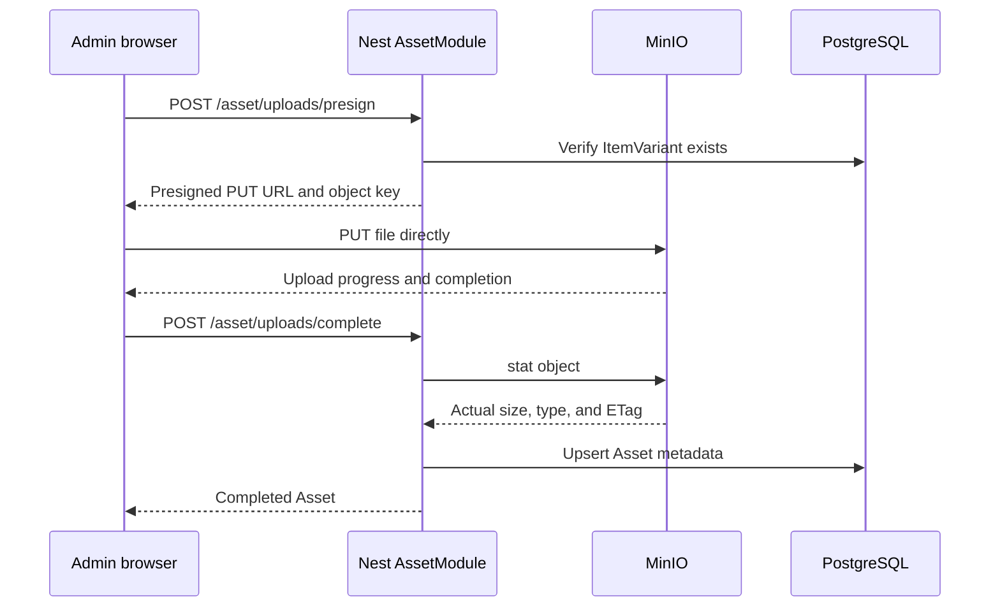

# S3 Assets Integration Learning Guide

This guide documents how to add product-image storage to Doxa using:

- The existing NestJS `AssetModule`
- Bun's native `S3Client`
- The shared MinIO instance on the VPS
- Direct browser-to-MinIO uploads using presigned URLs
- Axios upload-progress events
- Prisma for asset metadata

It is intentionally organized as a learning path. Implement and verify one phase before moving to the next.

## Current state

Doxa already has:

- `nest-backend/src/asset/asset.module.ts`
- `nest-backend/src/asset/asset.controller.ts`
- `nest-backend/src/asset/asset.service.ts`
- An `Asset` Prisma model related to `ItemVariant`
- Admin authorization through `JwtAuthGuard`, `RolesGuard`, and `@Roles(...)`
- Axios in the web application
- Product components that consume asset URLs

The current asset endpoint accepts arbitrary URLs and saves them in PostgreSQL. The target architecture replaces that write flow with managed object uploads.

The VPS storage setup is:

- Internal MinIO endpoint: `http://minio:9000`
- Public S3 endpoint: `https://storage.zaftech.co`
- Public console: `https://storage-console.zaftech.co`
- Bucket: `doxa-assets`
- Restricted MinIO user: `doxa-api`
- Policy: `doxa-assets-rw`
- Public object downloads: enabled for product imagery
- MinIO and the Doxa API share `proxy-net`

The MinIO setup is application-independent. Doxa owns its provisioning files under `/opt/doxa/storage`; the shared MinIO Compose file only runs MinIO.

---

## 1. Understand the architecture

The recommended upload flow is:



The important separation is:

| Component | Responsibility |
|---|---|
| Browser | Select files, upload bytes, show progress, cancel/retry |
| `AssetController` | Define authenticated HTTP endpoints |
| `AssetService` | Validate and orchestrate the asset lifecycle |
| Bun `S3Client` | Presign, inspect, write, and delete S3 objects |
| Prisma | Store asset metadata and variant relationships |
| MinIO | Store file bytes |

Do not send image bytes through Nest unless a future feature specifically requires server-side processing. Direct upload avoids consuming API memory, bandwidth, and request time.

---

## 2. Learn the essential S3 concepts

### Bucket

A bucket is a top-level object-storage container. Doxa uses:

```text
doxa-assets
```

### Object key

S3 does not have real directories. A key is the complete object name:

```text
item-variants/8c.../7e....webp
```

The slash-separated parts are prefixes that make objects appear organized.

Generate keys on the server. Never trust the browser to choose an unrestricted key.

### Policy

A policy defines what a MinIO user may do. The `doxa-api` user is restricted to operations on `doxa-assets`; it does not use MinIO root credentials.

### Presigned URL

A presigned URL grants temporary permission for exactly one S3 request, such as uploading one object with `PUT`. The browser receives the URL but never receives the S3 secret.

### Public URL

Doxa product images are publicly readable at URLs such as:

```text
https://storage.zaftech.co/doxa-assets/item-variants/<variant-id>/<uuid>.webp
```

Upload and deletion still require authenticated S3 requests. Public download access does not make writes public.

### CORS

MinIO enables CORS for buckets and HTTP verbs by default. The VPS preflight test returned `204` with the expected CORS headers. No `cors.xml` or `mc cors set` step is needed.

CORS is not authorization. A cross-origin upload still needs a valid presigned URL.

---

## 3. Confirm Bun is the runtime

Bun's native S3 API exists only under Bun. The backend scripts have been changed to launch Nest with Bun:

```json
{
  "dev": "bun --watch src/main.ts",
  "start": "bun src/main.ts",
  "start:dev": "bun --watch src/main.ts",
  "start:debug": "bun --inspect --watch src/main.ts",
  "start:prod": "bun dist/src/main.js"
}
```

The Nest CLI can still compile the application, but it must not be the production runtime.

Install Bun's TypeScript declarations in `nest-backend`:

```bash
bun add --dev @types/bun
```

Then confirm the editor understands:

```ts
import { S3Client } from "bun";
```

Useful Bun operations to learn first:

```ts
const client = new S3Client({
  accessKeyId: process.env.S3_ACCESS_KEY_ID!,
  secretAccessKey: process.env.S3_SECRET_ACCESS_KEY!,
  bucket: process.env.S3_BUCKET!,
  region: process.env.S3_REGION,
  endpoint: process.env.S3_INTERNAL_ENDPOINT,
});

await client.write("learning/test.txt", "hello", {
  type: "text/plain",
});

const exists = await client.exists("learning/test.txt");
const metadata = await client.stat("learning/test.txt");
await client.delete("learning/test.txt");
```

Official reference: <https://bun.com/docs/api/s3>

---

## 4. Configure application environment variables

The production API container needs:

```dotenv
S3_ACCESS_KEY_ID=doxa-api
S3_SECRET_ACCESS_KEY=<restricted-user-secret>
S3_BUCKET=doxa-assets
S3_REGION=us-east-1

S3_INTERNAL_ENDPOINT=http://minio:9000
S3_PUBLIC_ENDPOINT=https://storage.zaftech.co
ASSET_PUBLIC_BASE_URL=https://storage.zaftech.co/doxa-assets
```

Never put these in `NEXT_PUBLIC_*` variables. Only Nest should know the MinIO credentials.

### Why there are two endpoints

Use the internal endpoint for API-to-MinIO network operations:

```text
http://minio:9000
```

Use the public endpoint when generating browser-facing presigned URLs:

```text
https://storage.zaftech.co
```

A browser cannot resolve Docker's internal `minio` hostname. Do not sign an internal URL and replace its hostname afterward because the host participates in the S3 signature.

---

## 5. Improve the Prisma `Asset` model

The current model stores only a URL:

```prisma
model Asset {
    id            String @id @default(uuid())
    url           String
    itemVariantId String

    itemVariant ItemVariant @relation(fields: [itemVariantId], references: [id])
}
```

Store the object key as the durable storage identity. Keep `url` initially to avoid changing the existing storefront response shape all at once.

A useful first version is:

```prisma
model Asset {
    id            String   @id @default(uuid())
    key           String   @unique
    url           String
    originalName  String?
    contentType   String
    size          Int
    etag          String?
    position      Int      @default(0)
    itemVariantId String
    createdAt     DateTime @default(now())

    itemVariant ItemVariant @relation(
        fields: [itemVariantId],
        references: [id],
        onDelete: Cascade
    )
}
```

Why each field exists:

| Field | Purpose |
|---|---|
| `key` | Delete, inspect, and identify the MinIO object |
| `url` | Preserve current storefront compatibility |
| `originalName` | Admin display only; never use it as the key |
| `contentType` | Rendering and validation metadata |
| `size` | Validation and administrative display |
| `etag` | Useful for diagnostics and caching |
| `position` | Stable gallery ordering |

Create migrations during development:

```bash
bun run db:migrate
```

Apply committed migrations in production:

```bash
bun run db:migrate:deploy
```

Do not run `db:setup` in production because it runs the destructive seed.

### Migration decision

Existing seeded assets have external URLs and no MinIO key. Choose one of these explicitly:

1. Make `key`, `contentType`, and `size` nullable during migration, then backfill later.
2. Remove/reset development-only asset rows before making the fields required.
3. Import external images into MinIO and backfill all metadata.

Do not fabricate keys for external URLs.

---

## 6. Define the storage providers

Create two Nest injection tokens:

```ts
export const INTERNAL_S3 = Symbol("INTERNAL_S3");
export const PUBLIC_S3_SIGNER = Symbol("PUBLIC_S3_SIGNER");
```

Create a small required-environment helper:

```ts
function requiredEnv(name: string): string {
  const value = process.env[name];

  if (!value) {
    throw new Error(`${name} is required`);
  }

  return value;
}
```

Build shared credentials once:

```ts
function s3Credentials() {
  return {
    accessKeyId: requiredEnv("S3_ACCESS_KEY_ID"),
    secretAccessKey: requiredEnv("S3_SECRET_ACCESS_KEY"),
    bucket: requiredEnv("S3_BUCKET"),
    region: process.env.S3_REGION ?? "us-east-1",
  };
}
```

Define the providers:

```ts
import { S3Client } from "bun";

export const internalS3Provider = {
  provide: INTERNAL_S3,
  useFactory: () =>
    new S3Client({
      ...s3Credentials(),
      endpoint: requiredEnv("S3_INTERNAL_ENDPOINT"),
    }),
};

export const publicS3SignerProvider = {
  provide: PUBLIC_S3_SIGNER,
  useFactory: () =>
    new S3Client({
      ...s3Credentials(),
      endpoint: requiredEnv("S3_PUBLIC_ENDPOINT"),
    }),
};
```

Register them in `AssetModule`:

```ts
@Module({
  controllers: [AssetController],
  providers: [
    AssetService,
    internalS3Provider,
    publicS3SignerProvider,
  ],
  exports: [AssetService],
})
export class AssetModule {}
```

Inject both into `AssetService`:

```ts
constructor(
  private readonly prisma: PrismaService,
  @Inject(INTERNAL_S3) private readonly storage: S3Client,
  @Inject(PUBLIC_S3_SIGNER) private readonly signer: S3Client,
) {}
```

Why use Nest providers:

- Configuration is centralized.
- Missing environment variables fail at startup.
- Unit tests can inject fake clients.
- The service does not construct dependencies itself.
- Internal requests and public signatures use the correct host.

---

## 7. Define upload validation schemas

Replace arbitrary URL submission with two DTOs.

### Presign request

```ts
const allowedImageTypes = [
  "image/jpeg",
  "image/png",
  "image/webp",
  "image/avif",
] as const;

const MAX_IMAGE_SIZE = 10 * 1024 * 1024;

export const presignAssetUploadSchema = z.object({
  itemVariantId: z.string().uuid(),
  fileName: z.string().trim().min(1).max(255),
  contentType: z.enum(allowedImageTypes),
  size: z.number().int().positive().max(MAX_IMAGE_SIZE),
});
```

### Completion request

```ts
export const completeAssetUploadSchema = z.object({
  itemVariantId: z.string().uuid(),
  key: z.string().min(1).max(1024),
  originalName: z.string().trim().min(1).max(255),
  expectedContentType: z.enum(allowedImageTypes),
  expectedSize: z.number().int().positive().max(MAX_IMAGE_SIZE),
});
```

Browser validation improves UX but is not security. Repeat all validation in Nest.

---

## 8. Generate safe object keys

Do not place the original filename directly in the object key.

Use a server-owned MIME-to-extension map:

```ts
const extensionByContentType = {
  "image/jpeg": "jpg",
  "image/png": "png",
  "image/webp": "webp",
  "image/avif": "avif",
} as const;
```

Generate the key:

```ts
function buildAssetKey(
  itemVariantId: string,
  contentType: keyof typeof extensionByContentType,
): string {
  const extension = extensionByContentType[contentType];

  return `item-variants/${itemVariantId}/${crypto.randomUUID()}.${extension}`;
}
```

This prevents filename collisions and path manipulation while keeping objects grouped by variant.

---

## 9. Implement the presign endpoint

Add an authenticated endpoint:

```http
POST /asset/uploads/presign
```

Protect it exactly like the current asset creation endpoint:

```ts
@UseGuards(JwtAuthGuard, RolesGuard)
@Roles("SUPER_ADMIN", "EDITOR")
```

The service method should:

1. Validate the DTO.
2. Verify the `ItemVariant` exists.
3. Optionally enforce a maximum asset count per variant.
4. Generate the object key.
5. Generate a short-lived public presigned `PUT` URL.
6. Return the required headers with the ticket.

Core signing operation:

```ts
const uploadUrl = this.signer.presign(key, {
  method: "PUT",
  expiresIn: 5 * 60,
  type: dto.contentType,
});
```

Suggested response:

```ts
return {
  key,
  uploadUrl,
  expiresIn: 300,
  headers: {
    "Content-Type": dto.contentType,
  },
};
```

The browser must send the same content type used when signing.

Before building the frontend, inspect one generated URL and verify it starts with:

```text
https://storage.zaftech.co/
```

It must not contain `http://minio:9000`.

---

## 10. Implement direct upload progress in the web app

Axios is already installed and supports browser upload progress. Browser `fetch()` does not offer a convenient standard request-upload progress API, so use Axios for the direct MinIO `PUT`.

Do not use the existing `apiClient` for the MinIO request because it has:

- The Nest base URL
- `withCredentials: true`
- A default JSON content type
- Nest-specific response error handling

Use the existing API client only to request and complete upload tickets.

Create `web/lib/api/endpoints/assets-client.ts` with three conceptual operations:

```ts
assetsClientApi.presign(payload)
assetsClientApi.upload(ticket, file, options)
assetsClientApi.complete(payload)
```

The direct upload function can look like:

```ts
import axios from "axios";

export async function uploadAssetFile(
  uploadUrl: string,
  file: File,
  headers: Record<string, string>,
  options: {
    signal?: AbortSignal;
    onProgress: (progress: {
      loaded: number;
      total: number;
      percent: number;
    }) => void;
  },
): Promise<void> {
  await axios.put(uploadUrl, file, {
    headers,
    signal: options.signal,
    withCredentials: false,
    onUploadProgress: ({ loaded }) => {
      const total = file.size;
      const percent =
        total === 0 ? 0 : Math.min(100, Math.round((loaded / total) * 100));

      options.onProgress({ loaded, total, percent });
    },
  });
}
```

Send the `File` as the body. Do not wrap it in `FormData` for a presigned `PUT` unless the backend specifically implements a presigned POST policy.

### Upload states

Model the workflow as states, not only a percentage:

```ts
type UploadStatus =
  | "idle"
  | "requesting-url"
  | "uploading"
  | "finalizing"
  | "complete"
  | "error"
  | "cancelled";
```

A useful item model is:

```ts
type UploadItem = {
  id: string;
  file: File;
  status: UploadStatus;
  loaded: number;
  total: number;
  percent: number;
  error?: string;
};
```

The lifecycle is:

```text
idle -> requesting-url -> uploading -> finalizing -> complete
```

Axios reaching `100%` means the browser sent all bytes. It does not mean Nest has verified and recorded the object. Show `Finalizing...` while calling the completion endpoint.

### Cancellation

Create one `AbortController` per active file:

```ts
const controller = new AbortController();

await uploadAssetFile(ticket.uploadUrl, file, ticket.headers, {
  signal: controller.signal,
  onProgress: updateProgress,
});
```

Cancel with:

```ts
controller.abort();
```

If cancellation occurs, set the item to `cancelled` and do not call the completion endpoint.

### Accessible progress UI

Start with the native element:

```tsx
<div>
  <div className="flex justify-between text-sm">
    <span>{upload.file.name}</span>
    <span>{upload.percent}%</span>
  </div>

  <progress
    value={upload.percent}
    max={100}
    aria-label={`Uploading ${upload.file.name}`}
    className="w-full"
  />

  <p aria-live="polite">
    {upload.status === "finalizing" ? "Finalizing upload..." : null}
    {upload.status === "complete" ? "Upload complete" : null}
    {upload.status === "error" ? upload.error : null}
  </p>
</div>
```

If you later replace it with a custom visual bar, preserve `role="progressbar"`, `aria-valuemin`, `aria-valuemax`, and `aria-valuenow`.

---

## 11. Implement the completion endpoint

Add:

```http
POST /asset/uploads/complete
```

The service should:

1. Verify the `ItemVariant` exists.
2. Confirm the key starts with `item-variants/<itemVariantId>/`.
3. Call `storage.stat(key)` through the internal endpoint.
4. Compare actual size with `expectedSize`.
5. Validate the stored content type where available.
6. Construct the stable public URL.
7. Upsert the Prisma asset using the unique key.
8. Return the completed asset.

Construct the URL safely:

```ts
const baseUrl = requiredEnv("ASSET_PUBLIC_BASE_URL").replace(/\/$/, "");
const url = `${baseUrl}/${key}`;
```

Prefer an idempotent upsert:

```ts
return this.prisma.asset.upsert({
  where: { key },
  create: {
    key,
    url,
    originalName: dto.originalName,
    contentType: dto.expectedContentType,
    size: stat.size,
    etag: stat.etag,
    itemVariantId: dto.itemVariantId,
  },
  update: {
    url,
    originalName: dto.originalName,
    contentType: dto.expectedContentType,
    size: stat.size,
    etag: stat.etag,
  },
});
```

Idempotency matters because the upload may succeed while the browser temporarily loses connectivity before receiving the completion response. Retrying completion should not create a duplicate record.

### Stronger content validation

`Content-Type` is supplied by the uploader and is not proof that the bytes are an image. For stronger validation, read the first bytes with an S3 range/slice and verify the file signature before creating the database record.

Treat this as a hardening phase after the basic workflow works.

---

## 12. Add the upload orchestration function

The client workflow should be easy to read:

```ts
async function uploadOne(file: File, itemVariantId: string) {
  setStatus("requesting-url");

  const ticket = await assetsClientApi.presign({
    itemVariantId,
    fileName: file.name,
    contentType: file.type,
    size: file.size,
  });

  setStatus("uploading");

  await uploadAssetFile(ticket.uploadUrl, file, ticket.headers, {
    signal: controller.signal,
    onProgress: setProgress,
  });

  setStatus("finalizing");

  const asset = await assetsClientApi.complete({
    itemVariantId,
    key: ticket.key,
    originalName: file.name,
    expectedContentType: file.type,
    expectedSize: file.size,
  });

  setStatus("complete");
  return asset;
}
```

Handle each stage separately so retries do the least work:

| Failed stage | Retry behavior |
|---|---|
| Presign | Request a new ticket |
| Upload | Request a new ticket if the old URL expired, then upload again |
| Complete | Retry completion before re-uploading |
| Cancelled | Do not complete |
| Object missing during completion | Upload again |

---

## 13. Decide where the upload UI lives

The current variant form creates a variant and immediately navigates back to the item list. A variant must exist before its asset key can include the variant ID.

The cleanest UI is a separate page:

```text
/admin/items/<item-id>/variants/<variant-id>/assets
```

Recommended flow:

1. Create the variant.
2. Return a typed `ItemVariant` from `itemsClientApi.createVariant()` instead of `unknown`.
3. Navigate to the variant asset page.
4. Upload, reorder, retry, and delete images there.

This avoids ambiguous partial success where the variant is created but one or more images fail.

---

## 14. Support multiple files carefully

Start with one file, then sequential multiple-file uploads. Once both work reliably, add limited concurrency—usually two or three simultaneous uploads.

Do not launch every selected file at once.

Calculate overall progress by bytes, not by averaging percentages:

```ts
const totalBytes = uploads.reduce(
  (sum, upload) => sum + upload.total,
  0,
);

const uploadedBytes = uploads.reduce(
  (sum, upload) => sum + upload.loaded,
  0,
);

const overallPercent =
  totalBytes === 0
    ? 0
    : Math.round((uploadedBytes / totalBytes) * 100);
```

A 500 KB image and a 10 MB image should not contribute equally.

Useful first limits:

- Maximum 8 images per variant
- Maximum 10 MB per image
- JPEG, PNG, WebP, or AVIF
- Two concurrent uploads
- Five-minute presigned upload URLs

---

## 15. Implement deletion

Add an authenticated endpoint:

```http
DELETE /asset/:assetId
```

The service should:

1. Find the asset record.
2. Return `404` if it does not exist.
3. Delete `asset.key` from MinIO using the internal client.
4. Delete the Prisma row.
5. Return a success response.

Deleting from MinIO first is retry-friendly: if the database operation fails, retrying the endpoint can delete the already-missing object again and then remove the row.

Never derive an object key by parsing `asset.url`. Use the stored `key`.

---

## 16. Preserve and update the storefront contract

The storefront currently consumes asset URLs, including:

- Product cards through `assets[].url`
- Product details through a `string[]`
- `next/image`

The first integration can preserve these shapes while changing where the URLs originate.

Update `web/next.config.ts` to allow the MinIO hostname:

```ts
{
  protocol: "https",
  hostname: "storage.zaftech.co",
  pathname: "/doxa-assets/**",
}
```

After S3 becomes canonical, update `web/AGENTS.md` and remove the statement that Cloudinary is the canonical image host. Remove obsolete Cloudinary configuration only after confirming nothing else depends on it.

Because `doxa-assets` is publicly readable, Next.js image optimization can fetch product images normally.

---

## 17. Handle failures and orphaned objects

S3 and PostgreSQL cannot participate in one transaction. Design for partial success.

### Upload succeeds, completion never happens

The object exists without a database row. Possible cleanup strategies:

- Initially: periodically list the `item-variants/` prefix and compare it with database keys.
- Later: upload first under a temporary prefix and move/copy after confirmation.
- Later: apply a lifecycle rule for stale temporary uploads.

Do not add cleanup complexity before the main flow is working and observable.

### Database completion fails

Retry the completion endpoint. The unique key plus `upsert()` makes this safe.

### Delete succeeds in MinIO but fails in PostgreSQL

Retry deletion. S3 deletion is effectively idempotent, and the remaining database row still contains the key.

### Presigned URL expires

Request a new ticket. Do not attempt to extend or modify the old URL.

---

## 18. Test each layer

### A. Storage smoke test

Before Nest integration, use Bun and the restricted Doxa credentials to:

1. Write an object.
2. Call `stat()`.
3. Verify its public URL.
4. Delete it.

Never use MinIO root credentials from application code.

### B. Provider unit tests

Mock `INTERNAL_S3` and `PUBLIC_S3_SIGNER` in Nest tests. Verify:

- Missing environment values fail clearly.
- Presign uses the public endpoint provider.
- Completion uses the internal provider.
- Delete uses the stored key.

### C. Service unit tests

Cover:

- Variant not found
- Unsupported MIME type
- Oversized file
- Key-prefix mismatch
- Actual size mismatch
- Successful completion
- Repeated completion
- Successful deletion

### D. API integration tests

Verify guards reject unauthenticated and unauthorized callers. Verify valid admins can request tickets, complete uploads, and delete assets.

### E. Browser tests

Test:

- One successful upload
- Progress changing between 0 and 100
- Finalizing state after upload
- Cancellation
- Retry after failure
- Multiple files
- Page refresh after completion
- Product image rendering through `next/image`

### F. Production-network test

The final proof must use:

- The deployed API container
- `http://minio:9000` for internal operations
- A presigned URL on `https://storage.zaftech.co`
- The real browser origin
- The restricted `doxa-api` user

A local-only test cannot verify Docker DNS, the public endpoint, TLS, or Cloudflare routing.

---

## 19. Deployment considerations

The API image must:

- Use Bun as the runtime
- Include generated Prisma client code
- Include committed Prisma migrations
- Receive S3 and database secrets at runtime
- Join `proxy-net` and the PostgreSQL network

The web image needs only the public API URL at build/runtime as required by Next.js. It must not receive S3 credentials.

Run migrations once per deployment:

```bash
docker compose run --rm api bun run db:migrate:deploy
```

Then start/update services:

```bash
docker compose up -d
```

Do not run the development seed in production.

---

## 20. Recommended implementation order

Follow this order and commit each independently useful step:

1. Install `@types/bun` in `nest-backend`.
2. Write and run a temporary restricted-user S3 smoke test.
3. Add `key` and metadata fields to Prisma.
4. Resolve existing external asset migration strategy.
5. Generate and commit the Prisma migration.
6. Add internal and public S3 providers.
7. Add presign and completion Zod schemas.
8. Implement safe key generation.
9. Implement `POST /asset/uploads/presign`.
10. Verify generated URLs use `storage.zaftech.co`.
11. Add the frontend presign client method.
12. Add direct Axios `PUT` with progress.
13. Implement `POST /asset/uploads/complete`.
14. Add the finalizing state and completion call.
15. Add a dedicated variant-assets admin page.
16. Add cancellation and retry.
17. Add sequential multi-file upload.
18. Add limited concurrency and overall byte progress.
19. Implement deletion.
20. Add MinIO to `next/image` remote patterns.
21. Update the web architecture documentation from Cloudinary to MinIO.
22. Add unit and integration tests.
23. Validate the complete flow against the VPS.
24. Remove or restrict the old arbitrary-URL asset endpoint.

---

## 21. Definition of done

The integration is complete when:

- Nest runs under Bun in development and production.
- The API uses only the restricted `doxa-api` MinIO user.
- The browser never receives S3 credentials.
- Presigned upload URLs use `https://storage.zaftech.co`.
- File bytes travel directly from the browser to MinIO.
- Per-file progress, finalizing, error, cancellation, and retry states work.
- Completion verifies MinIO metadata before recording the asset.
- Prisma stores the object key and required metadata.
- Completion is idempotent.
- Deletion removes both the object and database row.
- The storefront renders MinIO assets with `next/image`.
- Existing unrelated asset URLs have an explicit migration strategy.
- Tests cover validation, authorization, retries, and partial failure.
- The end-to-end flow is verified from the production web origin.

---

## Further reading

- Bun S3 API: <https://bun.com/docs/api/s3>
- Bun TypeScript setup: <https://bun.com/docs/runtime/typescript>
- Axios upload progress: <https://axios-http.com/docs/req_config>
- Axios cancellation: <https://axios-http.com/docs/cancellation>
- MinIO client: <https://min.io/docs/minio/linux/reference/minio-mc.html>
- Prisma migrations: <https://www.prisma.io/docs/orm/prisma-migrate>
